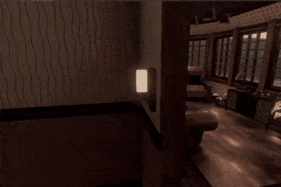
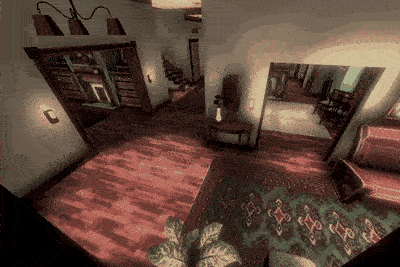

An interior architecture student (Hannah), two professors, and I worked together for 7 months to create this virtual reality tour that immerses users in the 1950's Magnolia House.

On January 11, 2021, I emailed a professor expressing my interest in the project. He assigned me the task of creating a Unity traffic system as an assessment. After installing Unity for the first time, I successfully programmed the system on a small level, impressing the professor and initiating our collaboration on the Magnolia House VR project.

## Project Requirements
- 3D model of the house and immersive audio
- Navigate in virtual reality with teleportation
- Quit the application through a menu
- Run on Meta Quest 2

## What I Did
After meeting with the client and understanding the project, Hannah and I started working.
While Hannah was modeling the house, I was developing the virtual reality features.

### NavMesh and Teleportation
Virtual reality is great, but it comes with motion sickness. Motion sickness is the body reacting to the visual perception of movement not matching the sense of balance. To stay away from motion sickness, we try not to use continuous movement, instead we teleport the player around (this isn't the only solution but I'm keeping it simple). 

I developed teleportation controls that utilize a NavMesh system popular in game development. The idea is to use a 3D model to define where the user can teleport to. When the user pushes the controller stick forward, this model will become visible, and the user will teleport by pointing where they want to be and releasing the stick.

Because there was only one level, I decided to hand model the NavMesh, this way I was able to customize it more than a generated one. I created a transparent blue material for it to separate it from the house.

### Fixed Horrible Performance
After I imported the house model and created shaders and lighting, there was a huge problem with the project - performance. The Oculus (Meta) Quest 2 was oscillating between 30 and 90 frames per second. This is not acceptable as it will create motion sickness on the user.

To increase the frame rate, I first analyzed what caused the drop in performance. I used Unity's performance profiler tool and quickly noticed that the number of triangles being rendered at once was astronomical. So I imported the model to Blender and removed an INSANE amount of triangles that the user would not see. The performance was better, but not by much.

After some research, I learned that Unity projects don't have culling enabled by default. I implemented occlusion and frustum culling, and the performance reached my target of 90 frames per second.

### Quit Button
I programmed a floating menu window that follows the user. This menu can be opened by pressing a button on the controller. The menu collides with the environment so that it's not intersecting with geometry and is visible. 

After opening the menu, the user can point the controller to the quit button and click to exit the application.

### Spatial Audio
Audio is a big part of immersion. To really sell the environment, I added some audio to the scene; birds chirping outside and music playing inside. But there was a problem, the audio didn't feel real. When the user moved around the house, the music audio would stay the same whether or not there was a wall between them and the audio source (a music player).

I developed a solution to calculate the distance it would take for the audio to reach the user. By knowing how much the audio needs to travel, I can adjust the music volume to make it feel like walls are muffling the sound. The audio sounded much better this way and users loved it!

## Links
An article written about this project:
[Magnolia House VR Article]

[Magnolia House VR Article]: https://cas.uncg.edu/virtual-reality-brings-the-past-to-life-at-magnolia-house/
