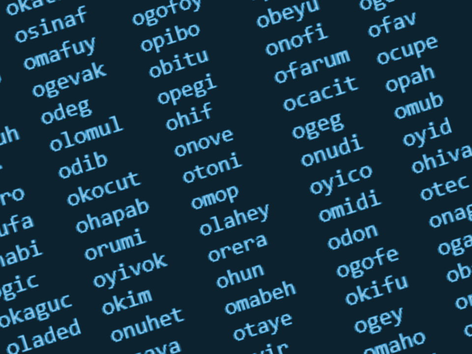

Finding a marketable name is very hard. So I wrote this python script to help me find a brand name.



On April 2 2020, I started a YouTube channel to post game development videos. Around 500 subscribers, I wanted to rename my channel to fit my vision better. I brainstormed but got exhausted. So I decided to write a program that would do the heavy work for me.

## How It Works
It's very simple, user overrides the `generate_letter` function. Inside the function, user calls instructions that the program will follow to decide which letters to pick to create a word. The following code block shows an example of how to generate a word that uses `any` letter and `switch`'es between vowels and consonants after each letter.

```
def generate_letter(index, word_index, word_length):
    wm.any()
    wm.switch()

wm._generate_letter = generate_letter
```

### Generating Words
Now that we have defined the instructions for our word, we can call the function that will start the generation process. Let's generate 999 four to six letter words and pass them into the `generated_words` variable.
```
generated_words = wm.make_words(4, 6, 999)
```

### Printing Out Results
Our `generated_words` variable contains the generated words. Let's print them out.
```
okepuk
ofufeq
amiki
ogeke
adoc
ijefoy
idega
...
```

Nice! We have 4-6 letter words that alternate between vowels and consonants. We can call other instructions to further customize our generated words, or we can write our own instructions!

## So, Does It Generate Brandable Names?
Maybe :D It's too random and often generates words that are hard to pronounce and don't sound great. But if you run it enough you'll come across something nice eventually, obviously that's not good.

## What's Next?
I am working on an improved version of Word Maker. I am taking the core idea of generating words from user defined procedures, and improving it by writing cleaner code and making it easier to use.

I am using Rust because I'm itching to create a project with it. I am also thinking about having a CLI to execute the program.

I see this project as a proof of concept. For the new version, I am focusing on having generated words that sound nice to the ear.