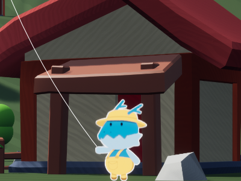
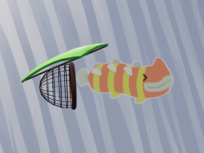
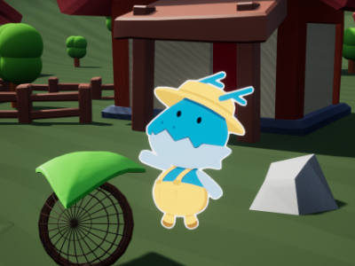
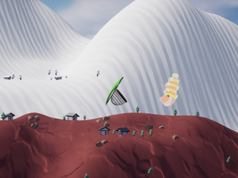

import TwoColumn from "../../components/content-components/TwoColumn.astro";

<TwoColumn>
    

        #### Preface
        I decided to join a 2-day game jam. The theme was **Fishing & No Water**. I met new people and formed a team of 12 people all around the world! We worked together on a Discord call to make it all happen.

        #### Flying The Kite
        We designed a game where you fish birds out of the sky using a kite. You control the kite to chase birds and catch them. I wrote logic that takes player input and flies the kite. I also wrote logic that detects the fish-birds, when the kite hovers over a fish-bird for a second, the fish-bird gets caught.
    

    

        
    

</TwoColumn>

<TwoColumn>
    

        #### Movement & Avoidance
        I made it so the fish-birds moved in random directions. To add some challenge, I wrote logic that detects if the kite is close to them. When the kite gets close to the fish-birds, they start swim-flying faster to escape.

        #### Adapting Music
        Our composers provided music for each level of the atmosphere. As the kite goes past the mountains into space, the music changes to signal the player that the difficulty is increasing. As the kite goes higher, harder fish-bird types start spawning in.

                #### Reeling Back
        Once the player is done bird-fishing, they can press spacebar to reel the kite back to Flamou (the dragon). Doing so rewards the player with coin corresponding to how much fish-birds they caught, and resets the levels.
    

    

        
    

</TwoColumn>

<TwoColumn>
    

                
    

    

        
    

</TwoColumn>