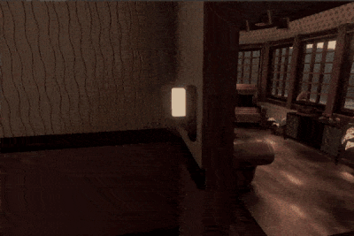
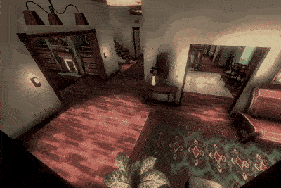
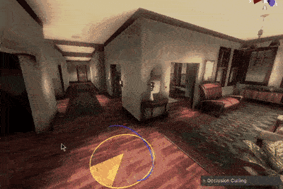

import TwoColumn from "../../components/content-components/TwoColumn.astro";

<TwoColumn>
    

        #### Preface
        I traded my Nintendo Switch for a Meta Quest and experienced VR for the first time, **I was blown away**. I emailed my professor on January 11 2021 to work with him on the Magnolia House - and got the job.   

        #### User Locomotion
        Your body might react to motion being shown through the headset. To reduce this reaction, I opted to teleport the user instead of moving them. I modeled a mesh that sits on the floor and spans the entire house. The user can point to this mesh in order to teleport around the house.  
    

    

        
    

</TwoColumn>

<TwoColumn>
    

        #### Laggy to Butter Smooth
        I increased the frames per second (FPS) from 30 to 90. After adding all models and visuals to the scene, I realized the FPS was unacceptable. I used the Unity performance profiler and noticed the number of triangles being rendered was astronomical. I removed unnecessary vertices from the models using Blender, and implemented occlusion & frustum culling. The FPS was at a fixed 90 after my optimizations, which is the Meta Quest 2's refresh rate.
    

    

        
    

</TwoColumn>

<TwoColumn>
    

        #### Spatial Audio
        To really immerse the user, I added music playing in the second floor. The music gets clearer as the user gets closer to it. This works by checking line of sight and distance from user to the music source. The added audio made a big impact on the experience and the users loved it.
    
        #### Floating Menu
        I programmed a floating menu window that follows the user when activated. The menu detects detects geometry and moves to keep a clear line of sight to the user. The user can quit the tour from this menu.
    

    

        
    

</TwoColumn>

    <a target="_blank" rel="noopener noreferrer" href="https://cas.uncg.edu/virtual-reality-brings-the-past-to-life-at-magnolia-house">Magnolia House VR News Article</a>

