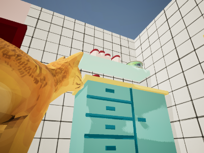
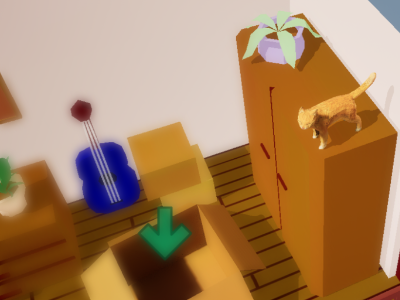
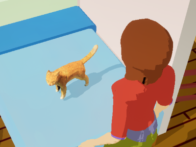
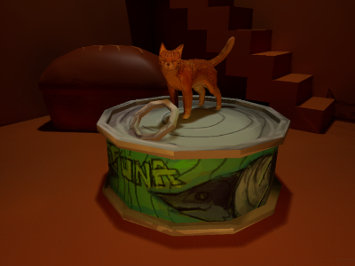
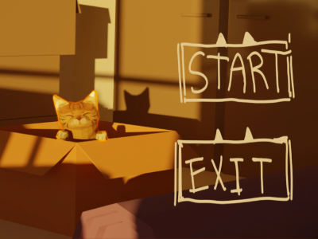
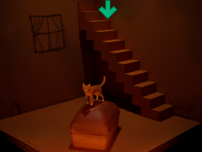

import TwoColumn from "../../components/content-components/TwoColumn.astro";

<TwoColumn>
    

        #### Preface
        I started joining game jams around March 2024. This project is one of my game jam entries - the theme was **Travel - All In A Box**. I assembled a team of 5 from people I met in the Discord server and started developing!

        #### Player Movement
        I enjoy games that have responsive feedback. I wrote the logic and polished character movement for a snappy and cat-like feeling. I used the ACharacter class that comes built-in to Unreal Engine. I tweaked the speed, air damping, gravity, and acceleration parameters to get the cat-like movement I wanted.  
    

    

        
    

</TwoColumn>

<TwoColumn>
    

        #### Platforming
        I imported the models made by our 3D artist into Unreal Engine and optimized the collisions so that the cat could fit under the chairs and table. The wardrobes, tables, cupboards, and frames in the level created a variety of platforms. I also added physics to some objects so the cat can bump into them and cause chaos! 
    
        #### NPC Pathfinding
        The human tries to catch the cat. I utilized a navigation mesh and A* algorithm to find the path from the human to the cat. The human movement logic reads the path and follows it until it reaches the cat. Once the cat is in it's range, the cat is caught and the run ends.  
    

    

        
    

</TwoColumn>

<TwoColumn>
    

        #### FMod Audio
        I worked with our audio designer to import FMod tracks into Unreal Engine and trigger them during gameplay. The properties of audio tracks are dynamically adjusted to fit the current environment of the game. For example, when the human detects the cat and starts chasing it, the music gets intense!
    
        #### Home Customization
        The cat can bring back items it finds while platforming around the house to its cardboard home. I programmed the item detection & item spawning system. I also created a system to save the items that the cat collected so they don't get lost when the game is quit.
    

    

                    
    

</TwoColumn>

<TwoColumn>
    

        #### Main Menu
        I wrote logic for the main menu - quitting the game, loading the gameplay level, and showing the tutorial screen.

    

    

        
    

</TwoColumn>

{/* <TwoColumn>
    

        
    

    

        
    

</TwoColumn> */}

    <a target="_blank" rel="noopener noreferrer" href="https://haft-indie.itch.io/you-are-not-my-cat">You Are Not My Cat!!! Itch.io Page</a>

